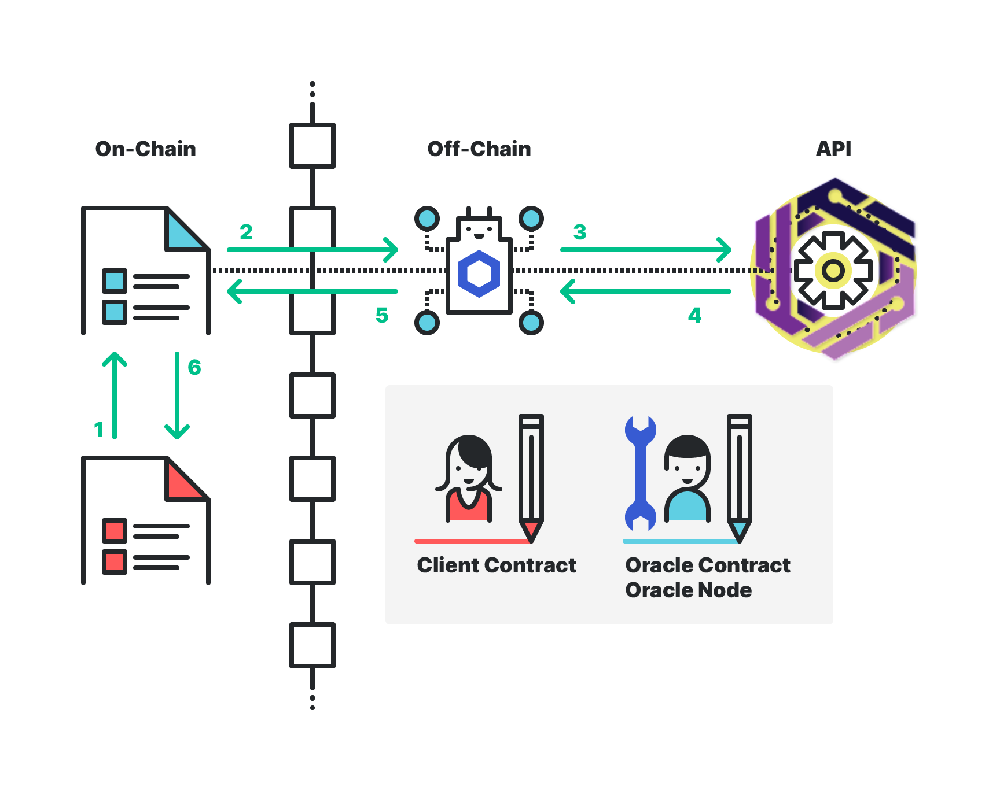

# NEAR-Shamba-Oracle

This repository serves to demonstrate how a smart contract on NEAR can access off-chain data using an incentivized oracle solution with fungible tokens as payments.

There are a number of subdirectories in the project that represent the moving pieces of a simple oracle system. 

- Client Contract (The contract that wants a token price from an off-chain API)
- Oracle Contract (An on-chain smart contract that accepts a fungible token payment and stores a request to be processed off-chain)
- Oracle Node (An off-chain machine continuously polling the Oracle Contract on NEAR, and fulfilling requests) 
    - **Note**: code for the Oracle Node is not included in this repository, to interact with that you can use the GUI tool described below.
- Fungible Token (The token paid by the Client Contract to the Oracle Contract in exchange for getting an answer to the Client's request)



## Get NEAR-CLI, Rust, and set up testnet accounts

We'll be using [NEAR CLI](https://docs.near.org/docs/development/near-cli), a command line tool that makes things simpler. Please have [NodeJS version 12 or greater](https://nodejs.org/en/download/package-manager/). Then install globally with:

```bash
npm install -g near-cli
```

These smart contracts are written in Rust. Please follow these directions to get Rust going on your local machine.

Install Rustup:

```bash
curl --proto '=https' --tlsv1.2 -sSf https://sh.rustup.rs | sh
```

([Official documentation](https://www.rust-lang.org/tools/install))

Follow the directions which includes running:

```bash
source $HOME/.cargo/env
```

Add wasm target to your toolchain:

```bash
rustup target add wasm32-unknown-unknown
```

([Info on wasm32-unknown-unknown](https://doc.rust-lang.org/edition-guide/rust-2018/platform-and-target-support/webassembly-support.html))

Rust is now ready on your machine.

Next, create a NEAR testnet account with [Wallet](https://wallet.testnet.near.org).

Set an environment variable to use in these examples. For instance, if your test account is `oracle.testnet` set it like so in your terminal:

```bash
export NEAR_ACCT=oracle.testnet
```

(**Windows users**: please look into using `set` instead of `export`, surrounding the environment variable in `%` instead of beginning with `$`, and using escaped double-quotes `\"` where necessary instead of the single-quotes provided in these instructions.)

Create sub-accounts::

```bash
near create-account oracle.$NEAR_ACCT --masterAccount $NEAR_ACCT
near create-account client.$NEAR_ACCT --masterAccount $NEAR_ACCT
near create-account oracle-node.$NEAR_ACCT --masterAccount $NEAR_ACCT
near create-account near-link.$NEAR_ACCT --masterAccount $NEAR_ACCT
```

We've gone over the different roles earlier, but let's focus on what will happen to get a request fulfilled.

**Client Contract** will call the **Oracle Contract** to make a request for external data.
**Client Contract** gives the **Oracle Contract** an allowance to take NEAR LINK from it. Before officially adding the request, it will `transfer_from` to capture the payment, keeping track of this amount in the `withdrawable_token` state variable.
The **Oracle Node** will be continuously polling the state of its **Oracle Contract** using the paginated `get_requests` function.
The **Oracle Node** will get the API results needed, and send back the answer to the **Oracle Contract**.
The **Oracle Contract** makes a cross-contract call to the callback address (NEAR account) at the callback method provided. It has now fulfilled the request and removes it from state.

## Build, deploy, and initialize

Let's begin!

Build the oracle, client, and NEAR LINK contracts with:

```bash
./build
```

Run all tests:

```bash
./test
```

Then deploy and instantiate like so…

NEAR LINK

```bash
near deploy --accountId near-link.$NEAR_ACCT --wasmFile near-link-token/res/near_link_token.wasm --initFunction new --initArgs '{"owner_id": "near-link.'$NEAR_ACCT'", "total_supply": "1000000"}'
```

Oracle contract

```bash
near deploy --accountId oracle.$NEAR_ACCT --wasmFile oracle/res/oracle.wasm --initFunction new --initArgs '{"link_id": "near-link.'$NEAR_ACCT'", "owner_id": "oracle.'$NEAR_ACCT'"}'
```

Client contract

```bash
near deploy --accountId client.$NEAR_ACCT --wasmFile client/res/client.wasm --initFunction new --initArgs '{"oracle_account": "oracle.'$NEAR_ACCT'"}'
```

## Minor housekeeping

Before the **oracle node** can fulfill the request, they must be authorized. We might as well do this from the get-go.

```bash
near call oracle.$NEAR_ACCT add_authorization '{"node": "oracle-node.'$NEAR_ACCT'"}' --accountId oracle.$NEAR_ACCT
```

(Optional) Check authorization to confirm:

```bash
near view oracle.$NEAR_ACCT is_authorized '{"node": "oracle-node.'$NEAR_ACCT'"}'
```

## Give fungible tokens and set allowances

Give 50 NEAR LINK to client:

```bash
near call near-link.$NEAR_ACCT transfer '{"new_owner_id": "client.'$NEAR_ACCT'", "amount": "50"}' --accountId near-link.$NEAR_ACCT --amount .0365
```

**Note**: above, we use the `amount` flag in order to pay for the state required. (See more about [state staking here](https://docs.near.org/docs/concepts/storage))

(Optional) Check balance to confirm:

```bash
near view near-link.$NEAR_ACCT get_balance '{"owner_id": "client.'$NEAR_ACCT'"}'
```

**client contract** gives **oracle contract** allowance to spend 20 NEAR LINK on their behalf:

```bash
near call near-link.$NEAR_ACCT inc_allowance '{"escrow_account_id": "oracle.'$NEAR_ACCT'", "amount": "20"}' --accountId client.$NEAR_ACCT --amount .0696
```

(Optional) Check allowance to confirm:

```bash
near view near-link.$NEAR_ACCT get_allowance '{"owner_id": "client.'$NEAR_ACCT'", "escrow_account_id": "oracle.'$NEAR_ACCT'"}'
```

## Make a request

You can use the GUI running on http://contracts-shamba.herokuapp.com/ for interacting (sending and fulfilling requests) with the oracle node.

1. The form-submit calls an API with the request body as the form details that the user has entered, in the format as shown below:

    Example of that API call is:

        URL: http://165.232.134.108:4000/

        Method: POST

        REQUEST Body:

        {
            "searchValue": "agg_max",
            "datasetCodeValue": "COPERNICUS/S2_SR",
            "selectedBandValue": "NDVI",
            "startDateValue": "2021-09-01",
            "endDateValue": "2021-09-10",
            "imageScaleValue": 250,
            "geometryValue": {"type": "FeatureCollection", "features": [{ "type": "Feature", "properties": {}, "geometry": { "type": "Polygon", "coordinates": [[[19.51171875, 4.214943141390651], [18.28125, -4.740675384778361], [26.894531249999996, -4.565473550710278], [27.24609375, 1.2303741774326145], [19.51171875, 4.214943141390651]]]}}]}
        }


        RESPONSE Body:

        {
            "result_type": "agg_max",
            "result": "0.924997091293335",
            "transactions": [
                "https://explorer.testnet.near.org/transactions/2yuzAgXhT6SzgeA7Pbea47Tf88BfaTMoC2EMjwXD1hbU",
                "https://explorer.testnet.near.org/transactions/tMvtmZifqkafzRYhAjgVsjGi4xcRS4Li7aQNbRbcVeo"
            ]
        }

2. Then, that API initiates a call to the "Client" NEAR contract requesting the "agg_value" (in the example shown above, it's "agg_max"). The Client Contract has an existing balance of 50 fungible tokens (FT) that it can access to pay for requests. 

3. With the above request being successful, the user gets a transaction url as the first transaction (in the above example, it's https://explorer.testnet.near.org/transactions/2yuzAgXhT6SzgeA7Pbea47Tf88BfaTMoC2EMjwXD1hbU i.e., the first element of the "transactions" array in the RESPONSE body of the API).

4. Along with that, 10 fungible tokens are sent to the on-chain Oracle Contract along with the user's request.

5. Then, the Oracle-Node that is being created using Chainlink, finds requests by consistently polling the on-chain Oracle Contract. When a new request is found, the Oracle-Node begins processing the request. The FT payment is locked until the Client Contract receives a successfully completed request.

6. With the original request in hand, the off-chain oracle node interfaces with the Shamba GeoAPI and retrieves the requested "agg_value" (in the example shown above, it's "agg_max").

7. The off-chain Oracle-Node passes the "agg_value" (i.e., "agg_max" in the above example) from the API to the on-chain Oracle Contract.

8. Hence, the on-chain Oracle Contract fulfills the original request by providing the "agg_value" (i.e., "agg_max" in the above example) from the API to the Client Contract. 

9. With this fulfilled request, the initial FT payment is now unlocked and can be accessed by the owner of the Oracle Contract / Oracle Node. Both the on-chain Oracle Contract and off-chain Oracle Node are typically owned by the same party.

10. Again, the user gets another transaction url as the second transaction (in the above example, it's https://explorer.testnet.near.org/transactions/tMvtmZifqkafzRYhAjgVsjGi4xcRS4Li7aQNbRbcVeo i.e., the second element of the "transactions" array in the RESPONSE body of the API).

11. Finally, the requested "agg_value" (i.e., "agg_max" in the above example) is now rendered to the front-end as a pop-up alert box, and both the transaction urls are shown in the "Transactions" tab.


## View pending requests

The oracle node is continually polling the state of the **oracle contract** to see the paginated request _summary_. This shows which accounts have requests pending and the total amount of pending requests:

```bash
near view oracle.$NEAR_ACCT get_requests_summary '{"max_num_accounts": "10"}'
```

**Note**: aside from `get_requests_summary` there is also `get_requests_summary_from`. Since the [`TreeMap` data structure](https://docs.rs/near-sdk/1.0.0/near_sdk/collections/struct.TreeMap.html) is ordered, the former will list the first N (`max_num_accounts`). Usage of `get_requests_summary_from` is for paging, providing a window of results to return. Please see function details for parameters and usage.


The previous command (calling the method `get_requests_summary`) is useful if there has been significant scaling from many client accounts/contracts. To see the individual requests for a particular user, use the following command:

```bash
near view oracle.$NEAR_ACCT get_requests '{"account": "client.'$NEAR_ACCT'", "max_requests": "10"}'
```


(Optional) Check the **client contract** for the values it has saved:

```bash
near view client.$NEAR_ACCT get_received_vals '{"max": "100"}'
```

## Check final balance/allowance

(Optional) Check the balance of **client contract**:

```bash
near view near-link.$NEAR_ACCT get_balance '{"owner_id": "client.'$NEAR_ACCT'"}'
```

Expect `40`

(Optional) Check the allowance of **oracle contract**:

```bash
near view near-link.$NEAR_ACCT get_allowance '{"owner_id": "client.'$NEAR_ACCT'", "escrow_account_id": "oracle.'$NEAR_ACCT'"}'
```

Expect `10`

The oracle node and oracle contract are assumed to be owned by the same person/entity. The oracle contract has "withdrawable tokens" that can be taken when it's most convenient. Some oracles may choose to transfer these tokens immediately after fulfillment. Here we are using the withdrawable pattern, where gas is conserved by not transferring after each request fulfillment.

Also, when the feature of cancelling requests is implemented, the withdrawable tokens is used to ensure the correct amount of fungible tokens can be withdrawn without interfering with possible cancellations within a given period.

## Withdraw tokens

(Optional) Check the withdrawable tokens on the oracle contract with this command:

```bash
near view oracle.$NEAR_ACCT get_withdrawable_tokens
```

(Optional) Check the fungible token balance of the client and the base account we'll be extracting to it. (This is the original account we set the `NEAR_ACCT` environment variable to, for demonstration purposes)

```bash
near view near-link.$NEAR_ACCT get_balance '{"owner_id": "oracle.'$NEAR_ACCT'"}'
near view near-link.$NEAR_ACCT get_balance '{"owner_id": "'$NEAR_ACCT'"}'
```

Finally, withdraw the fungible tokens from the oracle contract into the oracle node, the base account, who presumably owns both the oracle node and oracle contract.

```bash
near call oracle.$NEAR_ACCT withdraw '{"recipient": "oracle-node.'$NEAR_ACCT'", "amount": "10"}' --accountId oracle.$NEAR_ACCT --gas 300000000000000
```

You may use the previous two `get_balance` view methods to confirm that the fungible tokens have indeed been withdrawn.

## Notes

The client is responsible for making sure there is enough allowance for fungible token transfers. It may be advised to add a cushion in addition to expected fungible token transfers as duplicate requests will also decrease allowance.


    
